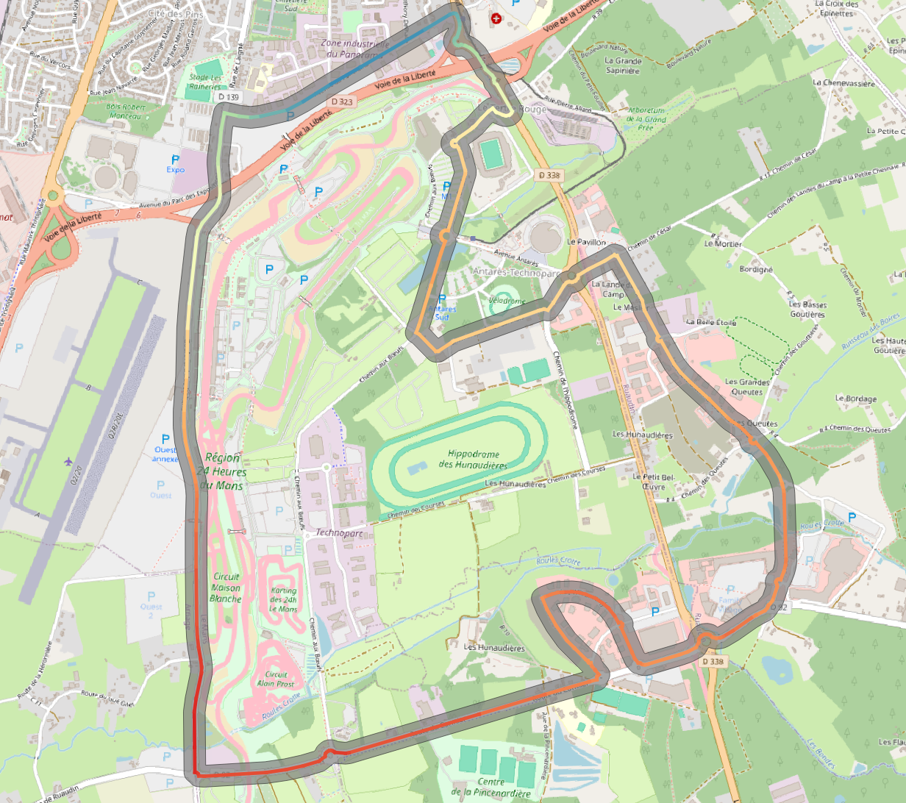
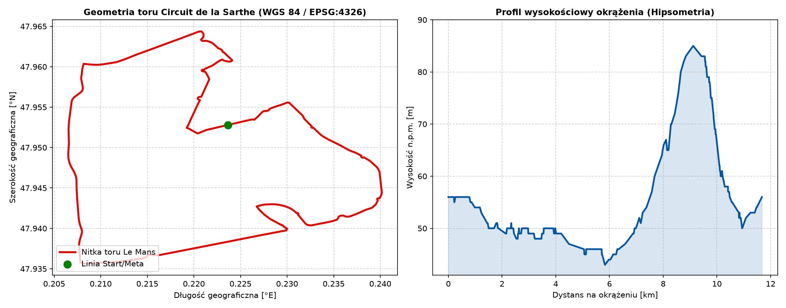
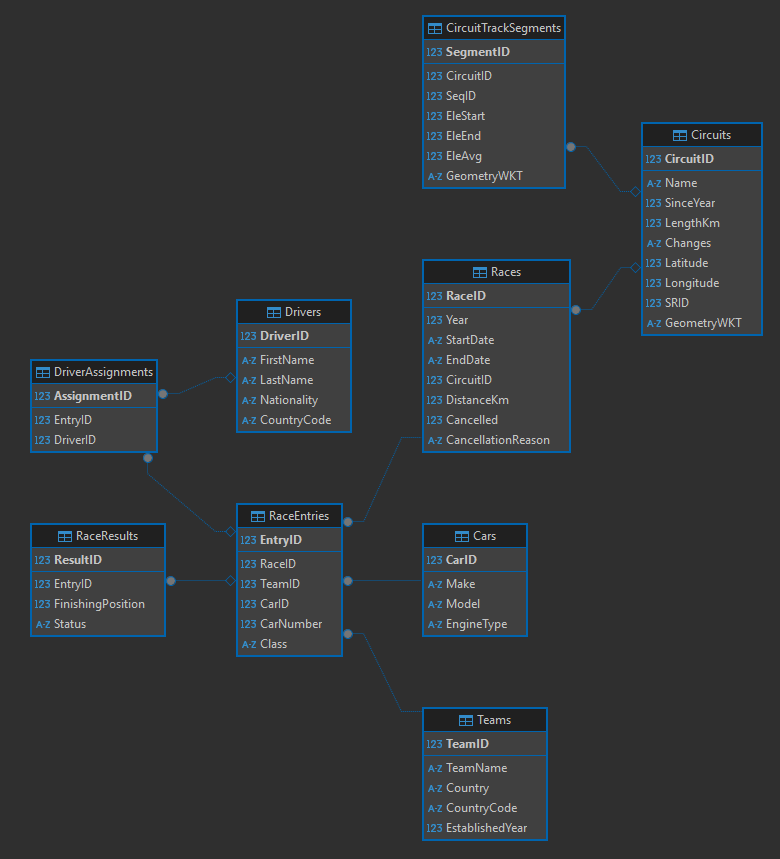
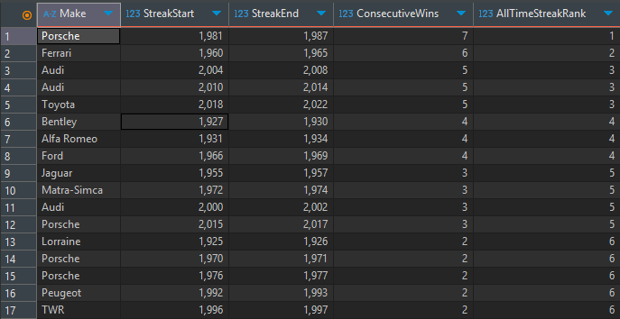
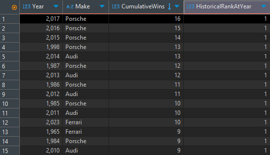
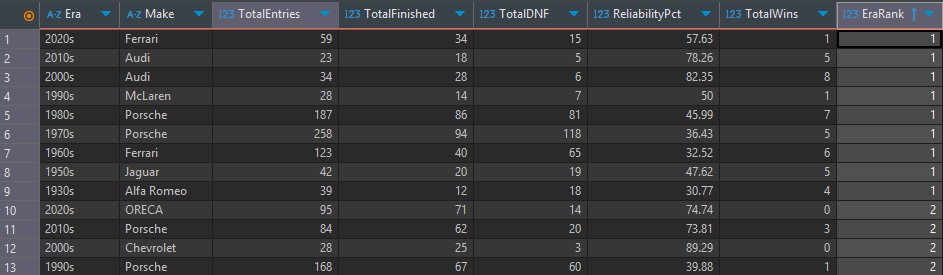

# Le Mans 24h: Baza Danych, Analityka Historii Wyścigu i Mapa Toru w QGIS

Projekt łączący pasję do motorsportu z inżynierią danych i geoinformatyką. Zbiera 100 lat historii legendarnego wyścigu 24h Le Mans (od pierwszej edycji w 1923 roku aż po 2023) w jednej, czystej bazie danych SQLite, wyciąga z niej kluczowe statystyki za pomocą zaawansowanego SQL oraz przenosi geometrię toru wraz z ukształtowaniem terenu do mapy w QGIS.

Zamiast ręcznego wklepywania tabel, cały proces — od pobrania surowych plików, przez czyszczenie danych, aż po wygenerowanie warstw mapowych — dzieje się automatycznie w Pythonie.

  

## Co robi ten projekt?

### 1. Automatycznie porządkuje ponad 5000 wpisów (potok ETL w Pythonie)

* Pobiera surowe, często „brudne” tabele historyczne (m.in. różne formaty dat, kierowcy zapisani w jednej linijce, niejednolicie ponazywane auta).
* Samodzielnie rozdziela nazwiska zawodników, przypisuje ich kraje, rozpoznaje marki pojazdów i układa wszystko w logiczne, połączone ze sobą tabele relacyjne.

### 2. Odpowiada na ciekawe pytania za pomocą SQL

* Które marki dominowały w poszczególnych dekadach i jak rosła ich suma zwycięstw rok po roku?
* Kto miał najdłuższą nieprzerwaną serię triumfów z rzędu (np. legendarne passy Porsche czy Audi)?
* Które stajnie były najbardziej niezawodne i rzadko kończyły wyścig awarią (DNF)?

### 3. Odwzorowuje tor wyścigowy w przestrzeni (GIS & QGIS)

* Przetwarza ślad GPS toru (Circuit des 24 Heures du Mans) z pliku GPX.
* Analizuje ukształtowanie terenu — bada każdy podjazd i zjazd na okrążeniu o długości 11,68 km.
* Generuje gotowy plik GeoPackage, który po przeciągnięciu do QGIS wyświetla nitkę toru jako płynną linię gradientową: od nizin na prostej Mulsanne (43 m n.p.m.) po szczyt pod słynnym mostem Dunlop (85 m n.p.m.).

## Wizualizacja i profil wysokościowy toru

  

Skrypt analityczny automatycznie przelicza dystans oraz wysokości terenu, generując gotowy wykres telemetryczny:

* **Różnica wysokości:** na jednym okrążeniu kierowcy pokonują dokładnie 42 metry przewyższenia.
* **Integracja z QGIS:** dzięki podzieleniu toru na mikro-odcinki z przypisaną wysokością początkową i końcową, w QGIS można użyć stylu *Linii interpolowanej*. Daje to efekt gładkiej wstęgi zmieniającej kolor wraz ze wznoszeniem się terenu na tle satelity lub mapy drogowej OpenStreetMap.

## Jak zorganizowana jest baza danych?

  

Baza SQLite (`LeMans24h.db`) została zaprojektowana tak, aby uniknąć powtarzania tych samych informacji i pilnować porządku relacyjnego:

* `Races` — wszystkie rozegrane edycje (rok, daty, dystans, ewentualne odwołania).
* `Circuits` — 15 historycznych konfiguracji toru (zmiany długości nitki, dodawane szykany, współrzędne geograficzne).
* `Teams` & `Drivers` — zespoły oraz kierowcy z przypisanymi narodowościami.
* `Cars` — modele aut z podziałem na markę, model i typ silnika.
* `RaceEntries` & `DriverAssignments` — zgłoszenia aut do konkretnego wyścigu wraz ze składem 2–3 kierowców przypadających na jedno auto.
* `RaceResults` — oficjalne pozycje na mecie, statusy ukończenia wyścigu lub powody wycofania (DNF).
* `CircuitTrackSegments` — wektory geometrii toru 3D wraz z wysokościami n.p.m.

## Przykładowe analizy SQL

W pliku `sql/analytics_queries.sql` znajdują się gotowe zapytania wykorzystujące zaawansowane techniki analityczne (Window Functions, CTE):

* **Bieżący ranking wszech czasów (`SUM() OVER`):** dynamicznie przelicza sumę zwycięstw czołowych producentów (Ferrari, Porsche, Audi, Bentley) rok po roku, pokazując, jak zmieniał się lider historycznej klasyfikacji.

  

* **Wykrywanie passy zwycięstw (`LAG()` — problem Gaps & Islands):** samodzielnie grupuje lata, w których dana marka wygrywała bez przerwy rok po roku, wyliczając najdłuższe serie w historii.

  

* **Wskaźnik bezawaryjności:** zestawia liczbę aut, które dojechały do mety, z tymi, które uległy awarii, wyliczając procentową niezawodność konstrukcji z podziałem na dekady.

  

## Jak uruchomić projekt na swoim własnym komputerze?

Projekt nie wymaga instalowania zewnętrznych serwerów baz danych — wszystko działa na lekkiej bazie SQLite i standardowych bibliotekach Pythona.

1. Pobranie i instalacja bibliotek
* git clone https://github.com/TwojNick/lemans-24h-database-gis.git cd lemans-24h-database-gis pip install -r requirements.txt
2. Zbudowanie bazy danych 
* python scripts/etl_lemans.py
3. Wygenerowanie warstw mapowych i wykresów
* python scripts/gis_lemans_analysis.py
4. Po wykonaniu skryptu plik lemans_geodata.gpkg wystarczy przeciągnąć bezpośrednio na mapę w darmowym programie QGIS.

## Technologie i narzędzia

* **Baza danych:** SQLite 3 (relacje, klucze obce, więzy spójności)
* **Język zapytań:** SQL (funkcje analityczne okna, agregacje, CTE)
* **Język skryptowy:** Python 3.10+
* **Przetwarzanie danych:** `pandas`, `xml.etree`
* **Geoinformatyka (GIS):** `geopandas`, `shapely`, QGIS (układy EPSG:4326 oraz metryczny EPSG:2154)
* **Wizualizacja:** `matplotlib`

## Źródła

* **Kaggle**: Le Mans 24 Hours autora Joakim Arvidsson
* **plotaroute**: Le Mans 24h Circuit

## Autor

Jakub Jankowski
